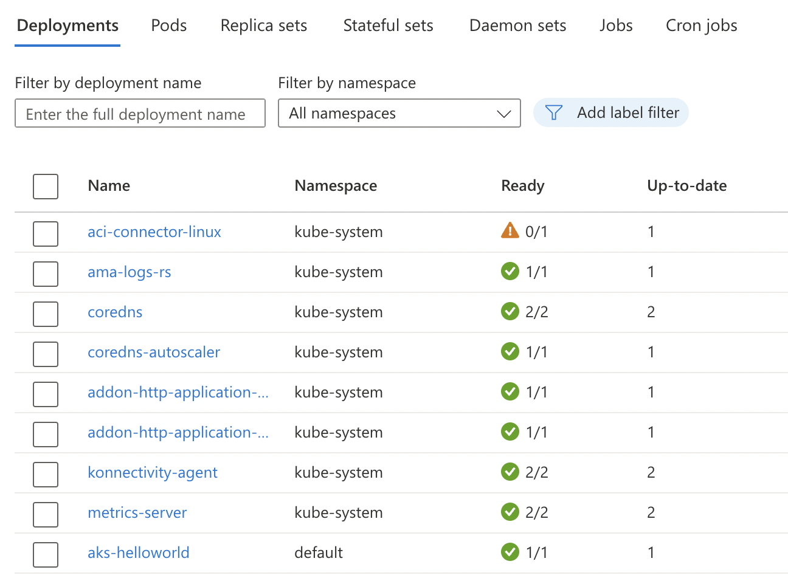

# Terraform module for loading AKS Application Routing Domain

When [HTTP Application Routing](https://learn.microsoft.com/en-us/azure/aks/http-application-routing)
is enabled on Azure AKS Kubernetes cluster, additional resources
are deployed by AKS, including a DNS zone publicly exposed.

There is unfortunately no Terraform way to retrieve the name of that zone
while the name is needed for later deployment of applications.
The purpose of this module is to replicate the process provided in
the documentation, and output the zone name
## Usage

```tf
module "application_routing" {
  source = "git::https://github.com/raphaeljoie/terraform-azure-aks.git//modules/application-routing-output?ref=v0.1.0"

  resource_group = "rg"
  cluster_name = "my-cluster"
}

resource "helm_release" "app" {
  name = "my-application"

  # See ./example-chart in this folder
  chart = "./example-chart?ref=v0.1.0"

  set {
    name = "host"
    value = "subdomain.${module.application_routing.zone_name}"
  }
}
```

## Extended context
When HTTP Application routing is enabled, there are extra resources
created 
* in the `kube-system` namespace 
* and in the managed "node resource group".

### Kube-system resources
* External DNS (`addon-http-application-routing-external-dns`)
* Nginx Ingress controller (`addon-http-application-routing-nginx-ingress-controller`)



### Azure resources
* A Load Balancer named `kubernetes`
* An identity named `httpapplicationrouting-map`
* A DNS zone
* A public IP
